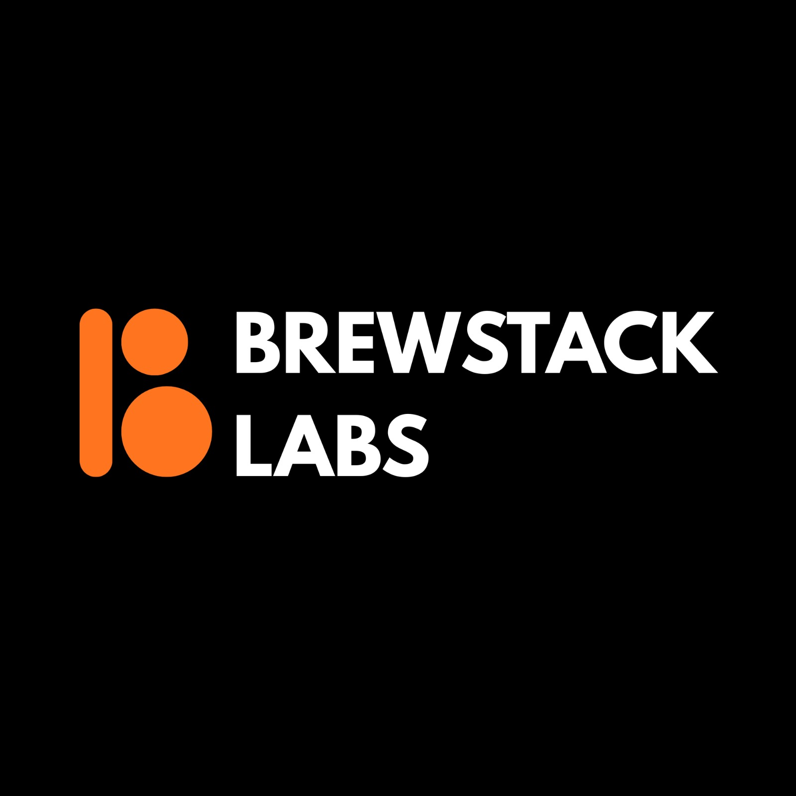

# ☕ Brewing Digital Excellence

**We build software and breathe life into ideas.** 
Our approach combines technical precision with artistic direction.

---

## 🚀 About Us

**Brewstack Labs** is a founder-led product engineering studio based in Colombo, Sri Lanka. We turn complex ideas into scalable, high-performance software. We blend strategy, design, and engineering into one streamlined process so founders and teams can launch faster, adapt confidently, and grow sustainably. 

From startup MVPs to enterprise-grade platforms, every project we take on is treated like a long-term partnership, not a short contract.

---

## 📜 The Brew Menu

We specialize in modern stacks that never break under pressure. Here is what we bring to the table:

*   🌐 **Architectural Grade Web:** Scalable, high-concurrency systems built to handle scale from day one.
*   📱 **Fluid Mobile Experiences:** Native-feel cross-platform apps that bridge the gap between utility and delight.
*   🎨 **Product Lab (UI/UX):** Science-backed design mapping user behavior to create second-nature interfaces.
*   ✨ **Brand Ecosystems:** Developing visual languages that resonate across every digital touchpoint.

---

## 🛠️ The Tech We Brew With

  
  <!-- Languages & Core -->
  
  
  
  
  
  
  
   

  <!-- Frontend -->
  
  
  
  
  
  
  
  
  
   

  <!-- Backend & APIs -->
  
  
  
  
  
  
  
  
   

  <!-- Databases & ORMs -->
  
  
  
  
  
  
  
   

  <!-- Mobile & Cross-Platform -->
  
  
  
  
  
   

  <!-- Cloud, DevOps & Infrastructure -->
  
  
  
  
  
  
  
  
  
  
   

  <!-- Tools & Design -->
  
  
  
  
  

---

## ⚙️ Our Brewing Cycle

A structured, agile methodology designed to ensure transparency and excellence at every step:

1.  **🫘 The Blend (Discovery & Strategy):** We dive deep into your requirements, selecting the optimal tech stack and mapping the project architecture.
2.  **🧪 The Distillation (Design & Prototyping):** Rapid iteration meets pixel perfection. We build high-fidelity prototypes to test assumptions early.
3.  **🏃 Agile Sprints:** Fueled by clean code and rigorous automated testing.
4.  **☕ The Pour (Deployment & Support):** Seamless delivery to production with ongoing monitoring to ensure your product stays at peak performance.

---

## 💡 The Brewstack Difference (Our Open Source Philosophy)

At Brewstack Labs, **"Code is a craft."** 
We believe in a **Clean-Code Culture**—meaning everything hosted in our repositories is maintainable, highly documented, and built with high-performance logic. We eliminate silos through our **Single-Source Edge**, ensuring our front-end and back-end are perfectly synchronized. We never just follow a spec; we iterate based on real-world market needs.

---

## 🤝 Let's build your next brand together.

We are a team of specialized co-founders executing with speed and discipline. Whether you want to explore our open-source contributions or collaborate on a premium digital product, we're ready.

 

 

*This README was made while we're caffeinated //////////////////////////*

